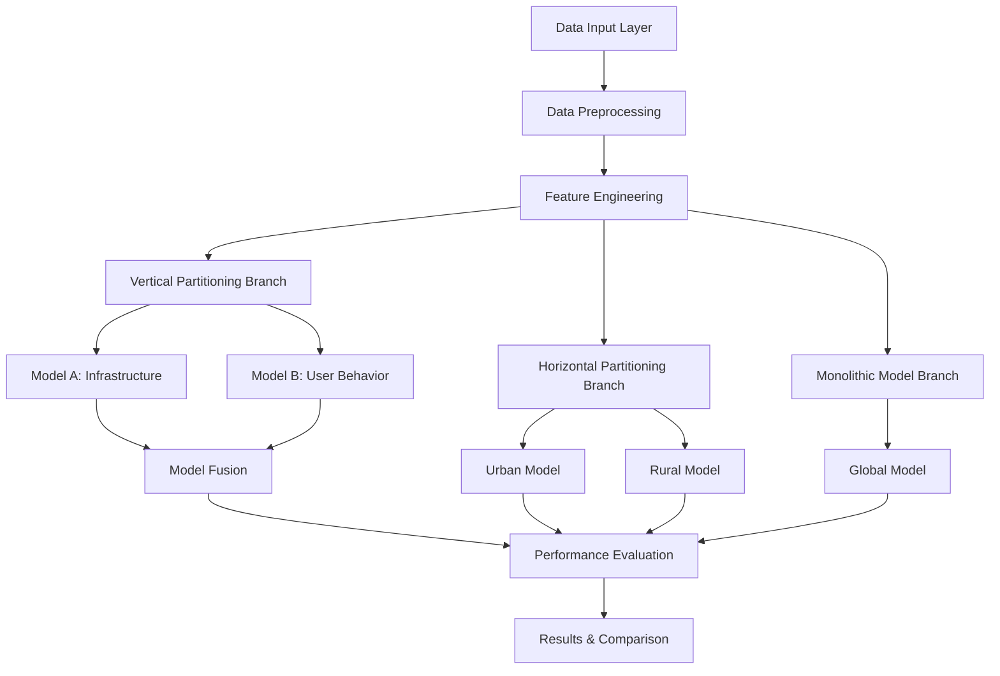

# Design Document

## Overview

The Network Latency Prediction System implements a comprehensive machine learning solution that uses both vertical and horizontal partitioning strategies to predict network latency. The system processes network infrastructure data, user behavior patterns, and geographical information to generate accurate latency predictions through multiple specialized models.

The design follows a modular architecture that enables comparison between different partitioning approaches: vertical partitioning (feature-based splitting) and horizontal partitioning (geographical-based splitting), alongside a baseline monolithic model for performance benchmarking.

## Architecture

### System Components



### Data Flow Architecture

1. **Input Layer**: Handles Excel dataset with columns: Tower ID, Signal Strength (dBm), Network Traffic (MB), Latency (ms), User Count, Device Type, Location Type
2. **Preprocessing Layer**: Data cleaning, validation, and transformation
3. **Feature Engineering Layer**: Feature selection and preparation for different model types
4. **Model Training Layer**: Parallel training of specialized models
5. **Evaluation Layer**: Performance comparison and analysis
6. **Output Layer**: Results, visualizations, and recommendations

## Components and Interfaces

### Data Processing Module

**DataLoader Class**
- `load_dataset(file_path: str) -> pd.DataFrame`
- `validate_data(df: pd.DataFrame) -> bool`
- `preprocess_data(df: pd.DataFrame) -> pd.DataFrame`

**FeatureEngineer Class**
- `split_vertical_features(df: pd.DataFrame) -> Tuple[pd.DataFrame, pd.DataFrame]`
- `split_horizontal_data(df: pd.DataFrame) -> Tuple[pd.DataFrame, pd.DataFrame]`
- `prepare_features(df: pd.DataFrame) -> Tuple[np.ndarray, np.ndarray]`

### Model Components

**BaseModel Class (Abstract)**
- `train(X: np.ndarray, y: np.ndarray) -> None`
- `predict(X: np.ndarray) -> np.ndarray`
- `evaluate(X: np.ndarray, y: np.ndarray) -> Dict[str, float]`

**InfrastructureModel Class (Model A)**
- Inherits from BaseModel
- Specialized for Signal Strength and Network Traffic features
- Uses regression algorithms optimized for infrastructure data

**UserBehaviorModel Class (Model B)**
- Inherits from BaseModel
- Specialized for User Count and Device Type features
- Handles categorical encoding for Device Type

**FusionModel Class**
- `combine_predictions(pred_a: np.ndarray, pred_b: np.ndarray) -> np.ndarray`
- Implements weighted averaging or stacking approaches

**GeographicalModel Class**
- Inherits from BaseModel
- Specialized for urban/rural geographical contexts

**MonolithicModel Class**
- Inherits from BaseModel
- Baseline model using all features together

### Evaluation Module

**ModelEvaluator Class**
- `calculate_metrics(y_true: np.ndarray, y_pred: np.ndarray) -> Dict[str, float]`
- `compare_models(models: List[BaseModel], test_data: pd.DataFrame) -> pd.DataFrame`
- `generate_performance_table() -> pd.DataFrame`

## Data Models

### Input Data Schema
```python
@dataclass
class NetworkData:
    tower_id: str
    signal_strength: float  # dBm
    network_traffic: float  # MB
    latency: float  # ms (target variable)
    user_count: int
    device_type: str  # categorical
    location_type: str  # Urban/Rural
```

### Feature Groups

**Infrastructure Features (Model A)**
- Signal Strength (dBm): Continuous variable, typically negative values
- Network Traffic (MB): Continuous variable, positive values
- Preprocessing: StandardScaler normalization

**User Behavior Features (Model B)**
- User Count: Integer variable, positive values
- Device Type: Categorical variable requiring one-hot encoding
- Preprocessing: StandardScaler for User Count, OneHotEncoder for Device Type

**Geographical Partitioning**
- Urban subset: Location Type == "Urban"
- Rural subset: Location Type == "Rural"
- If Location Type missing: Implement heuristic based on Signal Strength and User Count

### Model Configuration

**Algorithm Selection**
- Primary: Random Forest Regressor (handles mixed data types well)
- Alternative: Gradient Boosting Regressor for comparison
- Hyperparameter tuning using GridSearchCV

**Fusion Strategy**
- Weighted Average: w1 * pred_A + w2 * pred_B
- Weights determined through validation performance
- Alternative: Meta-learner (Linear Regression) on combined predictions

## Error Handling

### Data Validation
- Missing value detection and imputation strategies
- Outlier detection using IQR method
- Data type validation and conversion
- Range validation for numerical features

### Model Training Errors
- Insufficient data handling (minimum sample requirements)
- Convergence issues with iterative algorithms
- Memory management for large datasets
- Cross-validation fold failures

### Prediction Errors
- Input validation for prediction requests
- Model availability checks
- Feature dimension mismatches
- Graceful degradation when models fail

## Testing Strategy

### Unit Tests
- Data loading and preprocessing functions
- Feature engineering transformations
- Individual model training and prediction
- Evaluation metric calculations

### Integration Tests
- End-to-end pipeline execution
- Model fusion functionality
- Performance comparison workflows
- Data flow between components

### Performance Tests
- Model training time benchmarks
- Prediction latency measurements
- Memory usage profiling
- Scalability testing with larger datasets

### Validation Tests
- Cross-validation for model robustness
- Hold-out test set evaluation
- Statistical significance testing for model comparisons
- Residual analysis for prediction quality

### Deliverable Structure
- Jupyter Notebook for interactive analysis and visualization
- Python scripts for production-ready implementation
- Performance evaluation tables with statistical analysis
- Visualization plots for model comparison and insights